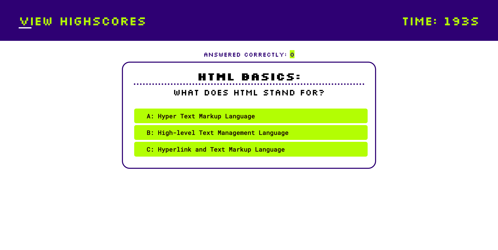

# Code Quiz App

## Overview

The Code Quiz App is a dynamic web application designed for users taking a front-end course. It features a quiz with questions in four main sections: HTML Basics, CSS Fundamentals, JavaScript Essentials, and Responsive Web Design.

## Features

- **High-Stakes Timer:** The countdown timer starts at 200 seconds when the user begins the quiz. Incorrect answers deduct 10 seconds. The game ends when the timer reaches 0 or the user answers all the questions.

- **Dynamic Feedback:** Instant feedback with both visual messages and interactive sound effects for correct and incorrect answers.

- **Leaderboard Glory:** After the quiz, users enter their name, and their score is added to the leaderboard, sorted in descending order based on scores.

- **Persistent Storage:** Local storage stores quiz questions (in `questions.js`) and leaderboard data.

- **Clear Scores Inferno:** "Clear Scores" button clears the leaderboard by incinerating local storage and refreshing the browser.

## Technology Stack

- HTML
- CSS
- JavaScript
- Web API

## Installation and Usage

Clone the repository and open `index.html` in your browser. The app is also hosted on [GitHub Pages](https://timatoyo.github.io/front-code-quiz/).

## GitHub Pages

Access the app on [GitHub Pages](https://timatoyo.github.io/front-code-quiz/).
## GitHub Repo

Access the app on [GitHub Repo](https://github.com/TimAtoyo/front-code-quiz).

## Screen shot of App

## Leaderboard Display

The leaderboard is on a separate page (`highscores.html`), presented as a numbered list showing the highest scores first.

## Testing

User testing has been conducted, ensuring a seamless experience. Future testing and refactoring planned for code quality elevation.

## Contributions

Contributions are welcomed! Follow standard guidelines when submitting changes or improvements.

## License

This project is currently not licensed.

## Next steps for Refactoring and Improvements

### Refactoring:

1. **Modularize Code:**
   -  modularise the JavaScript code into separate functions.

2. **Reuse Code:**
   - Identify opportunities to reuse code snippets for better maintainability.

3. **Improve CSS Structure:**
   - Organize CSS styles in a more modular and scalable way.

4. **Consistent Naming Conventions:**
   - Ensure consistent naming conventions across your codebase.

5. **Error Handling:**
   - Implement robust error handling mechanisms.

6. **Responsive Design:**
   - Double-check and enhance the responsive design.

7. **Code Comments:**
   - Add comments to explain complex logic.

### Additional Features:

1. **User Authentication:**
   - Personalize the leaderboard with user authentication.

2. **Difficulty Levels:**
   - Add difficulty levels for questions.

3. **Interactive Quiz Summary:**
   - Display a summary page at the end of the quiz.

### Testing:

1. **Automated Testing:**
   - Implement automated testing using frameworks like Jest.

2. **Accessibility Testing:**
   - Conduct accessibility testing.

